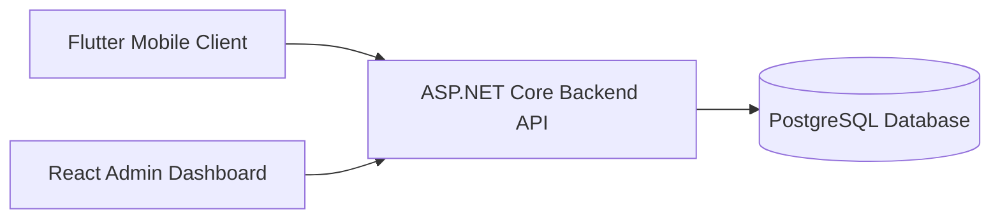

# Learning Platform — Monorepo Navigation & Technical Milestones - TEAM 3

* Ecem Nur Özen
* Gizem Gürtürk
* Karya Kinyas
* Betül Doğan

> A modular learning platform ecosystem consisting of a centralized backend API, a Flutter mobile client, and a React-based admin dashboard.

This repository acts as the main technical entry point for the entire ecosystem and provides architectural documentation, repository references, development milestones, infrastructure notes, and system-level overview documentation.

---

# Project Ecosystem

The platform is split into three independent repositories:

| Project            | Description                                                                                     |
| ------------------ | ----------------------------------------------------------------------------------------------- |
| Backend API        | Core business logic, authentication, database management, progress tracking, and admin services |
| Mobile Application | Flutter-based cross-platform mobile client                                                      |
| Admin Dashboard    | React-based administration and content management interface                                     |

---

# Architecture Overview



The architecture follows a service-oriented separation of concerns:

* The backend API handles all business logic and persistence.
* The mobile application consumes client-facing APIs.
* The admin dashboard consumes protected management endpoints.
* PostgreSQL acts as the centralized relational datastore.

---

# Backend API

## Repository

```text
github.com/ecemoz/LearningApp_backend
```

## Technology Stack

* ASP.NET Core Web API
* Entity Framework Core
* PostgreSQL
* JWT Authentication
* Swagger/OpenAPI
* Layered Architecture

## Core Responsibilities

* Authentication & authorization
* User management
* Topic and lesson management
* Quiz lifecycle management
* Achievement system
* User progress tracking
* Admin management endpoints
* Centralized validation and business rules
* Database migrations and seeding

## Internal Structure

```text
src/
├── LearningPlatform.API/
├── LearningPlatform.Application/
├── LearningPlatform.Domain/
└── LearningPlatform.Infrastructure/
```

---

# Mobile Application

## Repository

```text
github.com/ecemoz/learningapp_mobile
```

## Technology Stack

* Flutter
* Dart
* Feature-first architecture
* Repository pattern
* Stateful UI management

## Application Goals

* Deliver a responsive mobile learning experience
* Consume backend APIs securely
* Maintain scalable feature separation
* Support future AI-assisted modules
* Provide gamified user progression

## Mobile Structure

```text
lib/
├── app/
├── core/
│   ├── models/
│   ├── theme/
│   ├── widgets/
│   ├── data/
│   └── state/
└── features/
    ├── auth/
    ├── onboarding/
    ├── home/
    ├── topics/
    ├── lessons/
    ├── quizzes/
    ├── progress/
    ├── profile/
    └── ai_insights/
```

---

# Admin Dashboard

## Repository

```text
github.com/ecemoz/admin_panel
```

## Technology Stack

* React
* React Router
* Context API
* Modular feature architecture
* REST API integration

## Dashboard Responsibilities

* Administrative authentication
* Topic management
* Lesson management
* Quiz management
* User management
* Achievement management
* Dashboard analytics
* System monitoring entrypoints

## Admin Structure

```text
src/
├── api/
├── components/
├── context/
├── hooks/
├── layouts/
├── pages/
├── routes/
├── router/
└── lib/
```

---

# Shared Technical Goals

## Authentication System

* JWT-based authentication
* Role-based authorization
* Protected routes
* Token validation middleware
* Admin/client separation

## Database Goals

* PostgreSQL relational modeling
* Entity Framework migrations
* Seed data support
* Relationship integrity
* Expandable schema design

## API Standards

* RESTful endpoint structure
* Swagger/OpenAPI documentation
* Standardized error responses
* DTO-based communication
* Validation pipelines

## Scalability Targets

* Containerized deployment
* Cloud-ready infrastructure
* Modular architecture
* CI/CD automation
* Service isolation
* Monitoring & observability

---

# Summary

This ecosystem is designed as a scalable multi-platform learning infrastructure combining:

* A centralized ASP.NET Core backend
* A Flutter mobile application
* A React administration dashboard
* PostgreSQL-based persistence
* JWT-secured communication

The goal is to evolve the platform into a production-ready, scalable, and modular learning ecosystem with strong architectural separation and future AI integration support.
