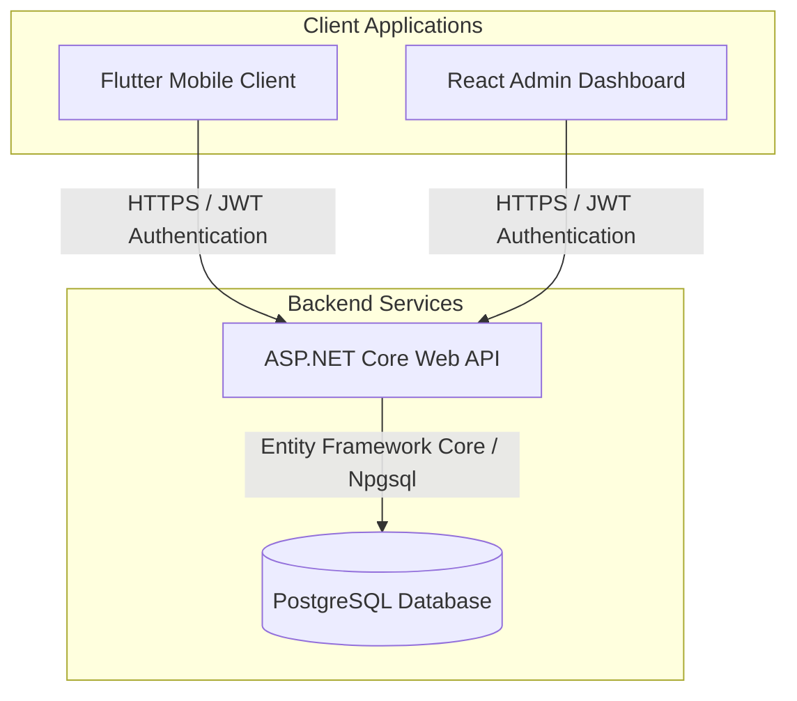

# Learning Platform - TEAM 3

* **Ecem Nur Özen**
* **Gizem Gürtürk**
* **Karya Kinyas**
* **Betül Doğan**

> A modular learning platform ecosystem consisting of a centralized backend API, a Flutter mobile client, and a React-based admin dashboard.

This repository acts as the main technical entry point for the entire ecosystem and provides architectural documentation, repository references, development milestones, infrastructure notes, and system-level overview documentation.

---

# Project Ecosystem

The platform is split into three independent repositories:

| Project | Stack / Technology | Description |
| :--- | :--- | :--- |
| **Backend API** |   | Core business logic, database migrations, authentication/authorization, and content management APIs. |
| **Mobile Application** |   | Flutter-based cross-platform mobile client featuring gamified progression, lessons, and quizzes. |
| **Admin Dashboard** |   | React-based administration and content management interface for managing learning materials. |

---

# Architecture Overview


```mermaid
flowchart TD
    subgraph Client Applications
        Mobile[Flutter Mobile Client]
        Admin[React Admin Dashboard]
    end

    subgraph Backend Services
        API[ASP.NET Core Web API]
        DB[(PostgreSQL Database)]
    end

    Mobile -->|HTTPS / JWT Authentication| API
    Admin -->|HTTPS / JWT Authentication| API
    API -->|Entity Framework Core / Npgsql| DB
```

The architecture follows a service-oriented separation of concerns:
* The backend API handles all business logic, validation rules, and relational persistence.
* The mobile application consumes client-facing APIs for learning and gamification tracking.
* The admin dashboard consumes protected management endpoints using role-based access control.
* PostgreSQL acts as the centralized relational datastore.

---

# Backend API

## Repository
```text
github.com/ecemoz/LearningApp_backend
```

## Technology Stack
* **Runtime / Framework:** .NET 10.0 (ASP.NET Core Web API)
* **ORM:** Entity Framework Core
* **Database:** PostgreSQL (via `Npgsql.EntityFrameworkCore.PostgreSQL`)
* **Security:** JWT Authentication & Role-based Authorization
* **Validation:** FluentValidation
* **Documentation:** Swagger/OpenAPI (via `Swashbuckle.AspNetCore`)
* **Architecture:** Layered Architecture (DDD principles)

## Core Responsibilities
* JWT Token generation and validation
* Role-based access control (Admin / Learner separation)
* Database migrations and seed data management (demo accounts, starter lessons/quizzes)
* Course, topic, lesson, and quiz management
* Learner progress tracking and completion logic
* Achievement triggering and gamification engines
* Global exception handling and validation pipeline

## Internal Structure
```text
src/
├── LearningApp.API/            # Controllers, DTOs, Program.cs, config
├── LearningApp.Application/    # Use-cases, services, and business orchestration
├── LearningApp.Domain/         # Entities, aggregates, and domain rules
└── LearningApp.Infrastructure/ # DB Context, migrations, auth services, seed data
```

---

# Mobile Application

## Repository
```text
github.com/ecemoz/learningapp_mobile
```

## Technology Stack
* **Framework:** Flutter SDK (Dart)
* **Architecture:** Feature-first architecture (Feature-based folder structure)
* **State Management:** Riverpod (`flutter_riverpod`) & `provider`
* **Navigation:** GoRouter (`go_router`)
* **HTTP Client:** Dio (`dio`) / HTTP
* **UI & Animation:** Google Fonts, Smooth Page Indicator, Flutter Animate

## Application Goals
* Deliver a high-performance, responsive multi-platform learning experience (iOS, Android, Web, Desktop)
* Secure local and remote session management using JWT
* Provide gamified features such as daily challenges, progress bars, and achievement popups
* Modular codebase structure to support future AI-assisted learning modules

## Mobile Structure
```text
lib/
├── app/                       # Routing configurations & app-level initialization
├── core/                      # Shared global resources
│   ├── data/                  # Remote/local data sources & API clients
│   ├── models/                # Shared domain models
│   ├── state/                 # Global state providers
│   ├── theme/                 # Global UI themes & colors
│   └── widgets/               # Reusable UI components
└── features/                  # Independent module directories
    ├── achievements/          # Badges & user reward system
    ├── ai_insights/           # Future AI-assisted feedback module
    ├── auth/                  # Login, register, and password reset flows
    ├── home/                  # Dashboard, daily stats, and summaries
    ├── lesson/                # Interactive lesson pages
    ├── onboarding/            # First-time user welcome slider
    ├── profile/               # User account & settings details
    ├── progress/              # Learning analytics & progress cards
    ├── quiz/                  # Quiz flow, options, and results page
    ├── settings/              # App configurations
    ├── shell/                 # Global navigation shell (Bottom Navigation Bar)
    ├── splash/                # Initial boot & auth-check screen
    └── topics/                # Subject/topic listings
```

---

# Admin Dashboard

## Repository
```text
github.com/ecemoz/admin_panel
```

## Technology Stack
* **Framework:** React
* **Routing:** React Router DOM
* **State Management:** Context API
* **Styles:** Vanilla CSS / Modern UI tokens
* **API Integration:** REST Client (Axios or Fetch API)

## Dashboard Responsibilities
* Administrative login & session persistence
* Topic CRUD (Create, Read, Update, Delete)
* Lesson content management (Markdown/Rich Text support)
* Quiz creation, questions, options, and correct answers configuration
* User management (Role modification, blocking, profile viewing)
* Achievement creation (Defining criteria, images, and points)
* System monitoring entry points & platform analytics

## Admin Structure
```text
src/
├── api/                       # API requests & endpoint configurations
├── components/                # Reusable UI components (Modals, Tables, Forms)
├── context/                   # Auth & Global application contexts
├── hooks/                     # Custom React hooks
├── layouts/                   # Dashboard layout, sidebar, and navbar wrappers
├── pages/                     # Routed pages (Dashboard, Lessons, Quizzes, Users)
├── router/                    # Route configurations (Protected & Public routes)
└── lib/                       # Utility functions & helper scripts
```

---

# Shared Technical Goals

## 🔑 Unified Authentication
* Shared JWT protocol ensuring secure API calls.
* Expiry, rotation, and secure local storage of JWT tokens across web and mobile clients.
* Strict API middleware check for roles (`Admin` vs. `Learner`).

## 🗄️ Relational Persistence
* Entity Framework migrations tracking database changes in PostgreSQL.
* Seed scripts supporting consistent database structures for developers.
* Relational integrity (Cascade deletes, foreign key restrictions) for user progress mapping.

## 📡 API Standards & Contracts
* RESTful routing layout (e.g., `/api/topics/{id}/lessons`).
* Strict DTO pattern to restrict payload sizes and prevent direct DB model leakage.
* Centralized error handler returning standardized RFC 7807 problem details.

## 🚀 Scalability & Operations
* Dockerized backend services for containerized production setup.
* CI/CD flows to automate linting, building, and unit testing.
* Health-check integrations on the API (`/health`) to monitor live status.

---

# Summary

This ecosystem represents a scalable multi-platform learning infrastructure combining an **ASP.NET Core** backend, a **Flutter** mobile client, and a **React** administration portal, using **PostgreSQL** as a single source of truth. Structured around modular design principles, the project ensures clean separation of concerns, strict type-safety, and prepares the platform for future feature enhancements (such as AI-driven insights).
